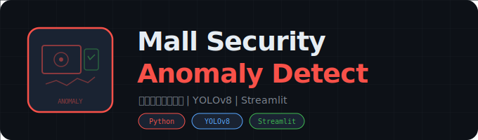

<div align="center">
  

  # Mall Anomaly Detection

  **商场视频监控异常行为检测系统**

  [](https://python.org)
  [](https://ultralytics.com)
  [](https://riverbankcomputing.com/software/pyqt/)
  [](LICENSE)
</div>

---

## 项目概述

Mall Anomaly Detection 是一个基于 YOLOv8 深度学习模型和 PyQt5 桌面 GUI 的商场视频监控异常行为检测系统。系统提供完整的用户登录注册界面，登录后进入主检测界面，支持图像单帧检测和视频逐帧实时检测两种模式。检测结果以边界框和中文标签的形式叠加在画面上，同时在控制面板中显示每个目标的类别和置信度。

## 技术栈

- **Python**: 核心编程语言
- **YOLOv8 (Ultralytics)**: 目标检测模型，二分类（异常/正常）
- **PyQt5**: 桌面 GUI 框架（QMainWindow、QThread、信号槽机制）
- **OpenCV**: 视频捕获、图像读取与缩放
- **Pillow (PIL)**: 中文文本绘制（解决 OpenCV 不支持中文的问题）
- **JSON**: 用户账户数据持久化

## 功能特性

- **用户登录注册系统** -- 渐变背景卡片式 UI，SHA-256 密码加密，JSON 文件存储用户数据，默认管理员账户 `admin/admin123`
- **图像检测模式** -- 选择单张图片（JPG/PNG/BMP），一键检测并在图像上绘制边界框和中文标签
- **视频检测模式** -- 选择视频文件（MP4/AVI/MOV/MKV），使用 `QThread` 多线程逐帧推理，实时更新画面
- **二分类检测** -- 自定义训练模型区分"异常"（class 0）和"正常"（class 1）两种行为
- **中文标签渲染** -- 自动检测系统中文字体（黑体/宋体/微软雅黑等），使用 PIL 在检测框上方绘制中文标签
- **进度条追踪** -- 视频检测模式下实时显示处理进度百分比
- **检测结果面板** -- 左侧控制面板实时显示每个检测目标的类别名称和置信度
- **状态栏** -- 底部显示当前登录用户名和实时时钟
- **工具栏** -- 顶部蓝色工具栏，包含"关于"和"退出"操作

## 安装说明

1. 克隆仓库到本地：
   ```bash
   git clone https://github.com/Past-Tang/mall-anomaly-detection.git
   cd mall-anomaly-detection
   ```

2. 安装依赖：
   ```bash
   pip install ultralytics opencv-python PyQt5 Pillow numpy
   ```

3. 确保模型文件就绪：
   - 将自定义训练的 YOLOv8 模型命名为 `best.pt` 放在项目根目录

## 使用方法

1. 启动应用：
   ```bash
   python main_app.py
   ```

2. 在登录界面输入账户信息：
   - 默认管理员：用户名 `admin`，密码 `admin123`
   - 也可在"注册"选项卡创建新账户

3. 登录成功后进入主检测界面：
   - **图像检测**：选择"图像检测"模式 -> 点击"选择文件"加载图片 -> 点击"开始检测"
   - **视频检测**：选择"视频检测"模式 -> 点击"选择文件"加载视频 -> 点击"开始检测" -> 可随时点击"停止检测"

4. 检测结果：
   - 画面上显示绿色边界框和中文类别标签
   - 左侧面板显示每个目标的类别和置信度
   - 视频模式下进度条实时更新

## 配置选项

| 参数 | 位置 | 默认值 | 说明 |
|:---|:---|:---|:---|
| `model_path` | `anomaly_detection_app.py` | `best.pt` | YOLOv8 模型文件路径 |
| `CLASS_NAMES` | `anomaly_detection_app.py` | `{0: '异常', 1: '正常'}` | 类别 ID 到中文名称的映射 |
| `user_data_file` | `login_register.py` | `user_data.json` | 用户账户数据文件 |
| 窗口最小尺寸 | `anomaly_detection_app.py` | `1200x800` | 主检测窗口最小尺寸 |

## 项目结构

```
mall-anomaly-detection/
├── main_app.py                # 应用入口：创建 QApplication，管理登录窗口和主窗口切换
├── anomaly_detection_app.py   # 主检测界面：控制面板、显示区域、图像/视频检测逻辑
│   ├── VideoThread            # QThread 子类，多线程视频逐帧推理
│   ├── AnomalyDetectionApp    # QMainWindow 子类，主界面布局和交互
│   └── cv2_add_chinese_text() # PIL 中文文本绘制工具函数
├── login_register.py          # 登录注册界面：渐变背景、选项卡切换、JSON 用户管理
├── best.pt                    # 自定义训练的 YOLOv8 异常检测模型
├── user_data.json             # 用户账户数据（运行时自动生成）
├── assets/
│   └── logo.svg               # 项目 Logo
├── LICENSE                    # MIT 许可证
└── README.md
```

## 核心架构

### 应用流程
```
main_app.py (QApplication)
  └── LoginRegisterWidget (登录/注册)
        │ login_successful 信号
        └── AnomalyDetectionApp (主检测界面)
              ├── 图像模式: YOLO(model_path)(image) -> 绘制边界框
              └── 视频模式: VideoThread(QThread) -> 逐帧推理 -> 信号更新 UI
```

### VideoThread 多线程设计
- `change_pixmap_signal`: 每帧推理完成后发送帧数据和检测结果到主线程
- `progress_signal`: 发送处理进度百分比
- `finished_signal`: 视频处理完成通知
- 使用 `self.running` 标志实现安全停止

### 中文文本渲染
OpenCV 原生不支持中文字符，系统通过 `cv2_add_chinese_text()` 函数：
1. 将 OpenCV BGR 图像转换为 PIL RGB 图像
2. 使用 PIL `ImageDraw` 绘制中文文本
3. 自动尝试 9 种中文字体（黑体、宋体、微软雅黑等）
4. 转换回 OpenCV BGR 格式

## 模型说明

### 自定义模型 (`best.pt`)
基于 YOLOv8 架构训练的二分类模型：
- **Class 0 -- 异常**: 监控画面中的异常行为
- **Class 1 -- 正常**: 正常行为

### 训练自己的模型
使用 Ultralytics 官方训练流程：
```bash
yolo train model=yolov8n.pt data=your_dataset.yaml epochs=100
```
训练完成后将 `best.pt` 复制到项目根目录，并根据需要修改 `CLASS_NAMES` 映射。

## 依赖项

| 包 | 版本 | 用途 |
|:---|:---|:---|
| ultralytics | >= 8.0 | YOLOv8 模型加载与推理 |
| PyQt5 | >= 5.15 | 桌面 GUI 框架 |
| opencv-python | >= 4.5 | 视频捕获与图像处理 |
| Pillow | >= 9.0 | 中文文本绘制 |
| numpy | >= 1.21 | 数组操作与数据转换 |

## 常见问题

### 模型加载失败？
确保 `best.pt` 文件在项目根目录下。如果使用自定义路径，修改 `anomaly_detection_app.py` 中的 `self.model_path`。

### 中文标签显示为乱码或方块？
系统会自动尝试多种中文字体。如果全部失败，会降级使用默认英文字体。确保 Windows 系统已安装黑体（SimHei）或微软雅黑字体。

### 视频检测卡顿？
视频检测使用 `QThread` 多线程，帧间休眠 10ms。如果仍然卡顿，可以：
- 使用更轻量的 YOLOv8n 模型
- 降低视频分辨率
- 增加 `time.sleep()` 间隔

### 如何添加更多检测类别？
修改 `anomaly_detection_app.py` 中的 `CLASS_NAMES` 字典，添加新的类别 ID 和中文名称映射。

### 默认管理员密码是什么？
用户名 `admin`，密码 `admin123`。首次运行时自动创建 `user_data.json`。

## 许可证

[MIT License](LICENSE)

## 免责声明

本项目仅供学习研究使用。视频监控涉及隐私问题，请遵守当地法律法规。请勿将本系统用于未经授权的监控场景。